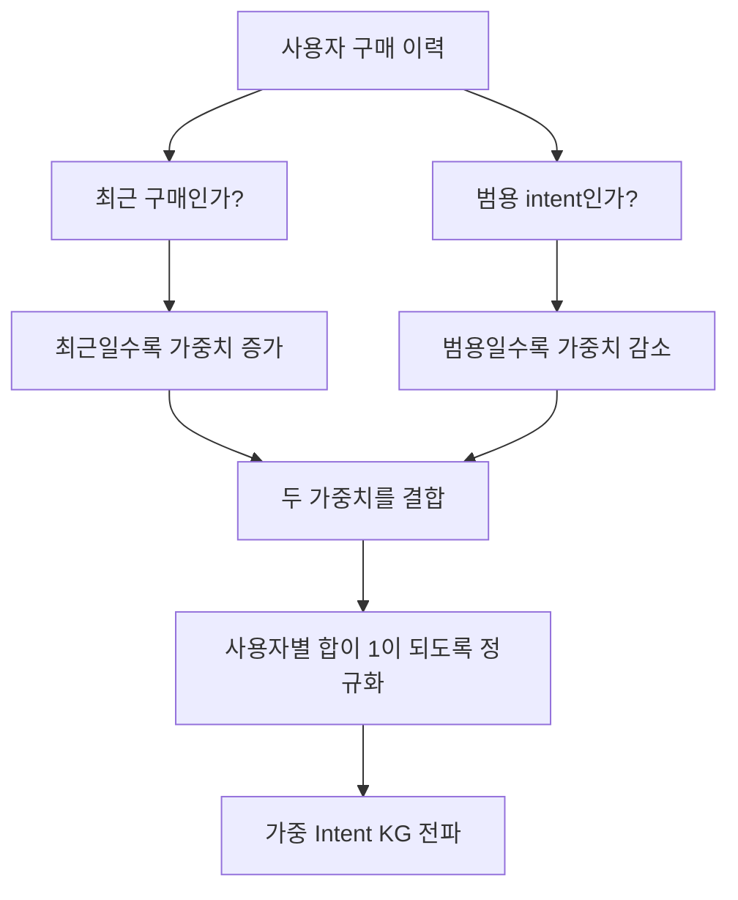

# 졸업프로젝트 진행 보고서 (2026.09.08)

- 주제: **LLM 기반 Intent KG와 동적 선호도를 활용한 추천 시스템**
- 데이터: Amazon Reviews 2018 — Clothing, Shoes and Jewelry
- 현재 목표: 상품을 단순히 반복 추천하지 않고, 최근 구매 맥락과 구매 의도(Intent)를 반영해 정확도·커버리지·롱테일 추천의 균형을 확인
- 기준 시점: 2026-09-08

---

## 1. 문제의식과 연구 방향

기존 협업필터링(CF)은 사용자-상품 상호작용만으로 추천하므로, 사용자가 같은 카테고리 안에서 무엇을 이미 구매했고 다음으로 어떤 목적의 상품을 찾을지 표현하기 어렵습니다.

본 프로젝트는 구매 이력과 리뷰/메타데이터에서 구매 의도를 추출해 Knowledge Graph(KG)에 넣고, 시간에 따라 달라지는 최근 선호를 반영하는 추천 구조를 검토하고 있습니다.

예를 들어 사용자가 최근 슬리퍼를 구매했다면, 단순히 슬리퍼를 다시 추천하기보다 “사무실에서 편안함을 원함”이라는 의도를 추정하고, 이후 상황에 맞는 다른 관련 상품을 탐색하는 것을 목표로 합니다.

---

## 2. 모델 구조 변화

### 2.1 초기 구조

```text
Interaction (user-item)
  → LLM intent 추출
  → Intent KG 구축
  → IKGR 추천
```

- 사용자와 상품 프로필에서 LLM으로 intent를 뽑아 intent node를 생성합니다.
- user–intent, item–intent edge를 통해 KG 정보를 추천 점수에 반영합니다.
- 문제: “comfortable daily”, “gift”처럼 너무 범용적인 intent가 많은 상품에 연결되면서 intent KG 단독 성능과 coverage가 오히려 하락했습니다.

### 2.2 개선 구조 (8/5 이후)

```text
Train interaction + static item metadata
  → LLM exact intent 추출 + related intent 확장
  → Intent KG / metadata KG 구축
  → IKGR backbone
  → DynLLM-style train-only recency profile
  → Adaptive intent weighting
  → CORONA soft rerank 또는 candidate retrieval
  → Top-K recommendation
```

| 개선 요소 | 의도 |
|---|---|
| Metadata KG | intent만으로 부족한 상품 측 side information(brand, category, attributes)을 보완 |
| Recency profile | 최근 구매를 오래된 구매보다 강하게 반영 |
| Adaptive intent weight | 너무 많은 상품과 연결된 범용 intent의 영향 축소 |
| Strict train-only KG | validation/test 시점의 item·intent 정보를 학습 그래프에서 제외하여 leakage 방지 |
| CORONA soft rerank | 전체 후보는 유지하면서 graph prior로 재정렬 |
| CORONA candidate retrieval | 후보군을 줄여 연산량을 낮추고 long-tail/diversity trade-off 확인 |
| Unified LLM extraction | exact/related intent를 한 호출에서 함께 생성하여 LLM 비용 절감 |

### 2.3 의도 edge 가중치 설계

개선안의 핵심은 **최근 구매에서 나온 구체적인 의도는 크게 반영하고, 많은 상품에 두루 연결된 범용 의도는 작게 반영한다**는 것입니다.



예를 들어 최근에 구매한 상품에서 나온 “사무실에서 발이 편한 상품”처럼 구체적인 intent는 큰 비중을 주고, “편안한 데일리”처럼 너무 많은 상품에 붙는 intent는 작은 비중을 주는 방식입니다.

| 판단 기준 | 가중치 변화 | 이유 |
|---|---|---|
| 최근 구매에서 나온 intent | 커짐 | 사용자의 현재 관심사일 가능성이 높음 |
| 오래된 구매에서 나온 intent | 작아짐 | 현재 관심사와 거리가 있을 수 있음 |
| 적은 상품과 연결된 구체적 intent | 커짐 | 추천 후보를 구분하는 데 도움이 됨 |
| 많은 상품과 연결된 범용 intent | 작아짐 | 특정 상품을 구별하는 정보가 약함 |

마지막으로 한 사용자가 가진 intent들의 가중치 합을 1로 맞춘 뒤 KG 전파에 반영합니다. 이렇게 해야 어떤 사용자는 연결이 많다는 이유만으로 intent 정보가 과도하게 커지지 않습니다.

---

## 3. 데이터와 평가 설정

### 3.1 초기 smoke 실험

- Amazon Clothing의 작은 deterministic sample
- 2,998 interactions / 292 users / 275 items
- Per-user temporal split(TO), seed 2020·2021·2022
- 지표: NDCG@10, Recall@10, long-tail Recall@10, Coverage@10

### 3.2 이후 primary 실험

- Amazon Clothing 5-core 기반 전처리 샘플
- 85,172 interactions / 10,515 users / 11,020 items
- TO: 사용자별 시간 순서 80/10/10 split
- TO_GLOBAL: 전체 시간 기준 70/10/20 split. train 이력이 없는 cold-start user도 평가
- 동일 설정: 12 epochs, embedding size 512, dropout 0.1, seed 2020·2021·2022

---

## 4. 성능 결과

### 4.1 초기 smoke 실험 결과

| Model | NDCG@10 | Recall@10 | Tail Recall@10 | Coverage@10 | 해석 |
|---|---:|---:|---:|---:|---|
| BPR | 0.0301 | 0.0503 | 0.0422 | 0.9976 | CF baseline |
| LightGCN | 0.0343 | 0.0648 | 0.0625 | 0.9988 | graph CF baseline |
| IKGR kgoff | 0.0348 | 0.0659 | 0.0637 | 0.9988 | backbone sanity check |
| Intent KG only | 0.0213 | 0.0381 | 0.0193 | 0.4582 | intent-only KG는 성능·coverage 하락 |
| Intent + metadata KG | 0.1121 | 0.1682 | 0.1560 | 0.4243 | metadata 추가 시 개선 |
| DynLLM-style recency | 0.3117 | 0.4401 | 0.4423 | 0.7054 | 최근성 반영이 큰 개선 |
| CORONA soft rerank | 0.3753 | 0.5079 | 0.5114 | 0.7345 | 다만 이후 strict leakage 검증 필요 확인 |

초기 high score 중 일부는 graph prior/transductive 경로의 영향 가능성이 발견되어, 이후 strict train-only KG로 재검증했습니다. 따라서 high score 자체를 최종 성과로 주장하지 않고 있습니다.

### 4.2 Strict train-only smoke 재검증

| Model | NDCG@10 | Tail Recall@10 | Coverage@10 | 비고 |
|---|---:|---:|---:|---|
| Adaptive gating + strict train-only KG + CORONA rerank | **0.3712 ± 0.0077** | 0.3795 | 0.7236 | validation에서 \(\lambda=0.75\) 선택 후 test 평가 |

이 결과는 test item의 intent/meta 정보를 graph prior에서 제외하고, train interaction만으로 recency 및 KG를 구성한 결과입니다.

### 4.3 Amazon Clothing primary 결과 — TO (warm temporal)

| Model | NDCG@10 | Recall@10 | Tail R@10 | Coverage@10 | Novelty |
|---|---:|---:|---:|---:|---:|
| IKGR kgoff | 0.1744 ± 0.0012 | 0.1976 | 0.0440 | 0.5757 | 11.4234 |
| BPR | 0.1744 ± 0.0011 | 0.1972 | 0.0442 | 0.5722 | 11.4306 |
| LightGCN | 0.1575 ± 0.0010 | 0.1802 | 0.0292 | 0.2159 | 10.1243 |
| Metadata only | 0.1359 ± 0.0028 | 0.1690 | 0.0437 | 0.4255 | 11.6374 |
| Intent + metadata heterogeneous KG | 0.0381 ± 0.0016 | 0.0739 | 0.0126 | 0.2079 | 10.2742 |
| DynLLM | 0.1287 ± 0.0007 | 0.1674 | 0.0351 | 0.3681 | 11.7259 |
| **IKGR full** | **0.1781 ± 0.0008** | **0.2029** | 0.0484 | **0.6383** | 11.9374 |
| CORONA candidate (de-biased) | 0.1530 ± 0.0022 | 0.1933 | **0.0501** | 0.6198 | **13.1237** |

**TO 해석**

- IKGR kgoff와 BPR가 거의 같아, 현재 구현의 ID mapping과 learnable backbone은 정상으로 보입니다.
- IKGR full은 BPR보다 NDCG@10이 +0.0037, Recall@10이 +0.0057이고 coverage는 +0.0661 개선되었습니다.
- Candidate CORONA는 overall NDCG는 낮지만, tail recall과 novelty가 가장 높았습니다. 즉 정확도 우위 모델이라기보다 long-tail/diversity용 trade-off로 해석해야 합니다.
- 단순 intent+metadata heterogeneous KG 결합은 큰 성능 저하를 보였습니다.

### 4.4 Amazon Clothing primary 결과 — TO_GLOBAL cold-start

TO_GLOBAL에서는 평가 대상 4,765명 중 train interaction이 0개인 cold0 user가 721명 포함되었습니다.

| Model | Cold NDCG@10 | Cold Recall@10 | Cold Recall@30 |
|---|---:|---:|---:|
| IKGR kgoff | 0.0254 ± 0.0039 | 0.0220 | 0.0436 |
| BPR | 0.0129 ± 0.0026 | 0.0130 | 0.0297 |
| **LightGCN** | **0.0301 ± 0.0083** | **0.0245** | **0.0528** |
| IKGR full | 0.0074 ± 0.0013 | 0.0073 | 0.0164 |
| CORONA candidate | 0.0023 ± 0.0004 | 0.0020 | 0.0025 |

**cold-start 해석:** 현재 결과만으로는 intent/KG/DynLLM이 genuine cold-start를 개선한다고 주장할 수 없습니다. 특히 hard candidate restriction은 cold-start에서 성능을 크게 낮췄습니다.

---

## 5. 비용 및 ablation 결과

LLM 호출 비용을 줄이기 위해 기존 `exact intent 추출 → related intent 확장`을 하나의 통합 호출로 바꾸는 실험을 수행했습니다.

| 방식 | 실제 API 호출 | Raw billable token | Graph 생성 시간 | NDCG@10 | Recall@10 |
|---|---:|---:|---:|---:|---:|
| 기존 3단계 파이프라인 | 41,656 | 29,129,669 | 721.27 s | 0.0337 ± 0.0013 | 0.0666 ± 0.0013 |
| 통합 1단계 추출 | 20,486 | 7,118,217 | 1323.44 s | 0.0444 ± 0.0010 | 0.0782 ± 0.0015 |

- 통합 방식은 API 호출 수와 raw token 비용을 크게 줄였습니다.
- 반면 graph 생성 시간은 더 길어졌으므로, API 비용 절감과 CPU 전처리 시간의 trade-off가 있습니다.
- Offline batch로 intent/KG/embedding을 미리 만들고, online에서는 저장된 embedding과 rerank만 쓰는 구성이 현실적입니다. 본 연구에서는 실제 serving latency까지 입증하지는 않았습니다.

Intent edge의 IDF 가중치 실험도 수행했습니다.

| Model | NDCG@10 | Recall@10 | NDCG 변화 |
|---|---:|---:|---:|
| Uniform intent edge | 0.0337 | 0.0666 | 기준 |
| IDF-weighted intent edge | 0.0361 | 0.0701 | +7.12% |

---

## 6. 현재 한계와 구현 점검 필요 사항

1. **Adaptive recency–specificity weight의 실제 적용 여부**  
   현재 코드에서는 \(W_{u,m,i}\)를 계산한 뒤 sparse adjacency를 만들 때 해당 값 대신 degree 기반 균등 정규화를 사용하고 있을 가능성이 있습니다. 즉 adaptive weight가 계산만 되고 message passing에 반영되지 않았을 수 있어, 가중 adjacency 적용 여부를 우선 점검해야 합니다.

2. **데이터 조건이 다른 실험의 직접 비교 위험**  
   365일 window가 적용된 smoke 실험은 interaction 수가 줄어듭니다. 성능 차이가 모델 개선 때문인지, 쉬워진 데이터셋 때문인지 분리하려면 동일 data/split에서 비교해야 합니다.

3. **후보군 M과 \(\lambda\) 선택 절차**  
   M과 \(\lambda\)는 validation에서 선택하고, 고정한 뒤 test를 한 번만 평가해야 합니다. test 결과를 보고 여러 값을 비교하면 선택 편향이 생깁니다.

4. **Intent 품질과 synonym 문제**  
   LLM이 비슷한 의미의 intent를 다른 표현으로 생성할 수 있으며, 범용 intent가 여전히 많이 연결될 수 있습니다. 최소/최대 degree filtering, synonym normalization, intent quality 표본 검토가 필요합니다.

5. **CORONA hard retrieval의 ceiling**  
   TO primary에서 M=500의 candidate recall@M은 0.3555입니다. 정답이 후보군 밖이면 reranker가 맞힐 수 없으므로 candidate recall을 정확도와 항상 함께 보고해야 합니다.

6. **현재 연구의 주장 범위**  
   “모든 조건에서 baseline보다 좋다” 또는 “cold-start를 해결한다”는 주장은 지원되지 않습니다. warm temporal 환경에서 정확도·coverage의 작은 개선, 그리고 long-tail/diversity trade-off가 현재 방어 가능한 결론입니다.

---

## 7. 다음 실험 제안

아래 ablation은 같은 데이터·split·LLM cache·seed·epoch를 고정하여 수행합니다.

| ID | Model | 확인하려는 효과 |
|---|---|---|
| M0 | BPR | CF baseline |
| M1 | IKGR-base: uniform intent KG | intent KG 자체 효과 |
| M2 | M1 + recency profile | 최신성 효과 |
| M3 | M2 + 실제 적용된 adaptive edge weight | 범용 intent 억제 효과 |
| M4a | M3 + soft CORONA rerank | recall 손실 없는 graph-prior 효과 |
| M4b | M3 + candidate CORONA | 계산량 감소와 long-tail/diversity trade-off |

- 첫 비교에서는 365일 filtering을 끄고 동일한 데이터로 M0–M4를 비교합니다.
- 이후 `M3` 대 `M3 + 365-day window`를 별도 실험해 recency filtering 자체의 효과를 확인합니다.
- `\alpha \in \{0.05, 0.1, 0.2\}`로 candidate M을 validation에서 고르고, `\lambda \in \{0, 0.1, 0.25, 0.5, 0.75\}`로 soft rerank를 선택합니다.
- 결과는 mean ± std(3 seeds)와 함께 overall Recall/NDCG, tail Recall, coverage, novelty, candidate Recall@M, runtime을 보고합니다.

---

## 9. 현재 결론

현재까지의 결과로 가장 안전하게 말할 수 있는 결론은 다음과 같습니다.

> LLM intent KG 단독 사용은 범용 intent 연결로 인해 성능과 coverage를 낮출 수 있었다. 그러나 metadata, train-only recency, 그리고 CORONA 계열 구성을 결합한 warm temporal 환경에서는 BPR 대비 작은 정확도 개선과 의미 있는 coverage 개선을 확인했다. De-biased candidate retrieval은 overall accuracy보다 long-tail과 novelty를 높이는 trade-off 모듈로 관찰되었다. 반면 genuine cold-start에서의 보편적 우위는 확인되지 않았으며, adaptive edge weighting의 실제 적용과 요소별 ablation이 다음 우선 과제이다.
